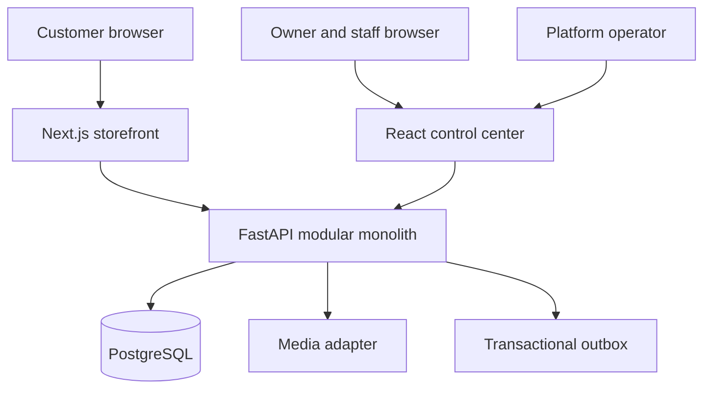

# Restaurant Engine
## Architecture and Delivery Blueprint

**Status:** Proposed clean restart architecture  
**Date:** July 14, 2026  
**Audience:** Product owner, architect, engineers, AI coding agents, and reviewers  
**Decision posture:** Optimize for quality, modularity, stability, security, learning, and controlled delivery—not maximum feature velocity.

---

## 1. Executive decision

Restaurant Engine should be rebuilt as a **modular monolith in a monorepo**, with:

- one FastAPI backend;
- one PostgreSQL database;
- one server-rendered public storefront built with Next.js;
- one React control-center application serving both restaurant administrators and platform administrators;
- shared TypeScript packages for UI, design tokens, generated API contracts, and utilities;
- strict tenant isolation enforced by application architecture, database constraints, and permanent automated tests;
- a deliberately small production topology that can run on one VPS;
- feature growth by domain module, not by adding services.

This is not a rewrite because the current work is bad. It is a controlled restart because the product has now taught us enough to establish the correct boundaries before orders, payments, messaging, and billing multiply the cost of structural mistakes.

The current prototype is valuable as a **reference implementation and requirements archive**. It is not the template for the new repository. Proven business rules and tests should be carried forward deliberately; files should not be copied wholesale.

### The architectural thesis

The product is a multi-tenant restaurant operating platform with three user experiences over one business system:

1. **Customer storefront** — fast, indexable, branded, accessible, and conversion-focused.
2. **Restaurant workspace** — operational, mobile-friendly, role-aware, and difficult to misuse.
3. **Platform control center** — tenant onboarding, entitlements, domains, support, audit, and lifecycle control.

The differentiator is not merely online ordering. It is the combination of premium storefront design, restaurant-native operational language, Bengali/English cultural relevance, and a platform architecture that can serve many restaurants without forking code.

---

## 2. Product definition

### 2.1 Initial market

The initial customers are independent Bengali-owned restaurants in Buffalo, New York, followed by selected restaurants in New York City. The platform must still avoid baking Bengali-specific assumptions into core domain logic.

Initial defaults:

- currency: USD;
- timezone: America/New_York;
- locales: English first, Bengali-capable;
- US address and phone formats;
- halal menu attributes treated as structured data;
- pickup ordering first;
- cash or pay-at-store first;
- single restaurant location per tenant in the first commercial release.

### 2.2 Users and responsibilities

| User | Primary jobs | Product surface |
|---|---|---|
| Guest customer | Browse, customize, order, track | Storefront |
| Returning customer | Reorder, view history, manage details | Storefront, later phase |
| Restaurant staff | View and advance orders, mark items unavailable | Restaurant workspace |
| Restaurant manager | Manage menu, hours, content, and staff | Restaurant workspace |
| Restaurant owner | Publish storefront, configure operations, review activity | Restaurant workspace |
| Platform operator | Onboard, suspend, support, assign design and features | Control center |
| Platform support user | Diagnose tenant issues with auditable, constrained access | Control center, later phase |

### 2.3 Product boundaries

#### First commercial release

- tenant onboarding;
- premium multi-tenant storefront;
- menu, categories, modifiers, availability, and media;
- hours and pickup availability;
- guest cart and pickup checkout;
- cash/pay-at-store order placement;
- customer order-status page;
- restaurant order board;
- role-based restaurant administration;
- system administration, feature entitlements, and audit events;
- subdomain hosting;
- production backup, monitoring, and recovery procedures.

#### Explicitly deferred

- delivery logistics;
- POS integrations;
- online card payments;
- native mobile apps;
- loyalty, gift cards, and subscriptions;
- AI assistants;
- restaurant reservations;
- SMS campaigns;
- marketplace or directory;
- multi-location tenants;
- automatic custom-domain provisioning;
- custom CSS or arbitrary HTML;
- microservices.

Deferral means the architecture preserves a clean seam; it does not mean placeholder implementations or empty modules should be created now.

---

## 3. Architecture principles

Every design and code review should test the change against these principles.

### 3.1 Tenant safety before convenience

Tenant identity must be explicit from HTTP request to database query. A repository method that reads tenant-owned data without accepting a tenant identifier is invalid. Unknown and suspended tenants must not leak whether data exists.

### 3.2 A modular monolith until evidence demands otherwise

Domains have clear public interfaces but share one deployable backend and one database. Modules may communicate through service calls and domain events inside the process. Network boundaries are introduced only when independent scaling, failure isolation, team ownership, or regulatory requirements justify them.

### 3.3 Business rules live behind application services

HTTP routers translate requests and responses. They do not contain workflows or direct persistence logic. Application services coordinate domain rules, repositories, transactions, permissions, and side effects.

### 3.4 Database constraints are part of the design

Validation in Pydantic and React improves experience; it is not the final integrity boundary. Unique constraints, check constraints, foreign keys, composite tenant-aware relationships, and transactional updates must protect important invariants.

### 3.5 Make invalid states difficult to represent

Use enums and state machines for restaurant status, storefront publication, order status, and availability. Money is stored as integer minor units. Historical orders contain snapshots and never depend on the current menu.

### 3.6 Simple operations are a feature

The first production system should fit on one VPS and be recoverable from documented backups. Every additional database, queue, cache, or service must have a concrete current use—not a speculative future use.

### 3.7 Generated contracts prevent frontend/backend drift

The OpenAPI document is the API contract. TypeScript types and the client are generated from it. Handwritten frontend copies of backend enums are prohibited unless they are display-only mappings backed by generated values.

### 3.8 Accessibility, security, and observability are acceptance criteria

They are not final cleanup milestones. Critical flows are inaccessible, insecure, or unobservable until proven otherwise.

### 3.9 Optimize for reversible decisions

Prefer adapters, configuration, and narrow interfaces for media, email, payments, and messaging. Avoid abstractions inside stable core domains merely to appear flexible.

### 3.10 Documentation is executable context

Architecture decisions, domain rules, API contracts, and runbooks live beside the code and are updated in the same change that alters behavior.

---

## 4. System shape



### 4.1 Deployable units

| Unit | Responsibility | Runtime |
|---|---|---|
| Storefront | Tenant resolution, SSR pages, SEO metadata, customer interaction | Next.js Node process |
| Control center | Restaurant and platform administration | React/Vite static assets |
| API | Authentication, authorization, domains, workflows, persistence | FastAPI process |
| Database | Durable transactional state, constraints, sessions, outbox | PostgreSQL |
| Reverse proxy | TLS, host routing, compression, request limits | Nginx initially |
| Backup job | Encrypted database and media backups, retention checks | Scheduled container/host job |

There is no Redis, message broker, search engine, Kubernetes cluster, or service mesh in the initial architecture.

### 4.2 Why two frontend applications, not three

The public storefront has fundamentally different needs: server rendering, SEO, tenant-domain routing, caching, structured data, and extreme performance discipline. It deserves its own application.

Restaurant administration and system administration share authentication, navigation, tables, forms, drawers, audit patterns, and operational design. They belong in one control-center application with permission-gated route groups. Separate deployments would duplicate code and create contract drift without providing meaningful isolation.

### 4.3 Why not a full-stack Next.js backend

The existing FastAPI and Python knowledge, strong API tests, SQLAlchemy model, and future integration needs make a dedicated API the lower-risk choice. Next.js is responsible for presentation and server rendering, not for duplicating business logic.

---

## 5. Technology decisions

Use compatible stable releases and lock exact versions in the repository. Upgrade dependencies intentionally through small pull requests; do not code against floating `latest` tags.

| Concern | Decision | Reason |
|---|---|---|
| Repository | pnpm workspace monorepo | One change can safely update API, client, and UI; no copied packages |
| Backend | Python, FastAPI, Pydantic, SQLAlchemy 2, Alembic | Proven stack, typed contracts, excellent API ergonomics |
| Database | PostgreSQL | Transactions, constraints, JSONB where justified, operational maturity |
| Storefront | Next.js App Router with server rendering | SEO, metadata, tenant host routing, progressive enhancement |
| Control center | React, TypeScript strict, Vite, React Router | Fast SPA workflow and explicit administrative routing |
| Server state | TanStack Query | Cache, retries, invalidation, loading/error discipline |
| Forms | React Hook Form plus schema resolver | Predictable forms without bespoke state plumbing |
| Frontend validation | Zod only for UI-specific/form concerns | API truth remains generated from OpenAPI |
| API client | Generated from FastAPI OpenAPI plus thin handwritten facade | Prevents contract drift while keeping call sites readable |
| Styling | CSS variables, CSS Modules, shared tokens, shared admin UI package | Controlled design without runtime styling dependency |
| Backend tests | pytest | Domain, service, API, tenancy, and integration tests |
| Frontend tests | Vitest and Testing Library | Focused component and utility tests |
| End-to-end tests | Playwright | Cross-surface business journeys and tenant isolation |
| Lint/format | Ruff for Python; ESLint and Prettier for TypeScript | Fast, deterministic CI |
| Containers | Docker Compose | Reproducible local and single-VPS production topology |
| CI | GitHub Actions | Repeatable quality gates before merge |

### 5.1 Dependencies deliberately not selected

- No Redux unless client-only state becomes complex enough to justify it. Cart state can begin with a small reducer and persisted schema.
- No generic component megaframework for the storefront. The visual identity is a product asset.
- No ORM repository abstraction that attempts to hide SQLAlchemy completely.
- No event broker until an asynchronous workload requires independent retries or throughput.
- No GraphQL; the use cases are well served by typed REST resources and commands.
- No Turborepo initially. pnpm workspaces plus direct scripts are sufficient; add task orchestration only when build time becomes a measured issue.

---

## 6. Repository design

```text
restaurant-engine/
├── apps/
│   ├── storefront/                 # Next.js public experience
│   └── control-center/             # restaurant + platform administration
├── packages/
│   ├── api-client/                 # generated client; never hand-edit generated files
│   ├── admin-ui/                   # shared operational components
│   ├── design-tokens/              # colors, spacing, typography contracts
│   └── frontend-config/            # shared TS/ESLint/Prettier configuration
├── backend/
│   ├── app/
│   │   ├── core/                   # settings, database, security, tenancy, errors
│   │   ├── domains/
│   │   │   ├── identity/
│   │   │   ├── tenants/
│   │   │   ├── catalog/
│   │   │   ├── storefront/
│   │   │   ├── media/
│   │   │   ├── hours/
│   │   │   ├── orders/
│   │   │   └── audit/
│   │   ├── api/                    # composition and shared HTTP concerns
│   │   └── main.py
│   ├── migrations/
│   ├── tests/
│   │   ├── unit/
│   │   ├── integration/
│   │   ├── api/
│   │   └── security/
│   └── pyproject.toml
├── e2e/                            # Playwright journeys
├── docs/
│   ├── 00_PROJECT_START.md
│   ├── 01_PRODUCT_SCOPE.md
│   ├── 02_ARCHITECTURE.md
│   ├── 03_DOMAIN_RULES.md
│   ├── 04_SECURITY_AND_TENANCY.md
│   ├── 05_DEVELOPMENT_WORKFLOW.md
│   ├── 06_TEST_STRATEGY.md
│   ├── 07_DEPLOYMENT_RUNBOOK.md
│   ├── 08_ROADMAP.md
│   └── decisions/
├── scripts/                        # repeatable developer and ops commands
├── .github/workflows/
├── compose.yaml
├── compose.prod.yaml
├── pnpm-workspace.yaml
├── Makefile                        # memorable cross-stack commands
└── .gitattributes                  # LF repository policy
```

### 6.1 Backend domain module template

Create files only when they have a responsibility. A mature domain may contain:

```text
domains/catalog/
├── models.py            # SQLAlchemy persistence models
├── schemas.py           # API input/output schemas
├── entities.py          # pure domain types only when useful
├── repository.py        # tenant-safe data access
├── service.py           # workflows and transaction boundary
├── policies.py          # reusable permission/business policies
├── router_admin.py
├── router_public.py
└── events.py            # domain event definitions, when needed
```

Do not generate every file for every domain on day one. Start with `models`, `schemas`, `service`, `repository`, and the necessary router. Split when a file has multiple reasons to change.

### 6.2 Dependency direction

HTTP depends on application services. Services depend on domain policies and repository protocols. Repository implementations depend on SQLAlchemy. Core infrastructure does not import routers.

Cross-domain writes are coordinated by an application service with one transaction. A domain must not import another domain's SQLAlchemy model to implement hidden business logic. It calls an explicit service/query interface or uses a published read model.

---

## 7. Domain boundaries

### 7.1 Identity and access

Owns users, credentials, sessions, memberships, roles, password reset, and account lifecycle.

Initial roles:

- `platform_admin` — platform-wide lifecycle access;
- `owner` — full restaurant administration except platform-governed settings;
- `manager` — menu, storefront content, hours, and orders;
- `staff` — operational order access and limited availability updates.

Permissions should be named capabilities such as `menu.write` and `orders.advance`, then mapped from roles in one policy module. Avoid scattering role string comparisons across routers and components.

### 7.2 Tenants

Owns restaurants, status, slug, locale defaults, currency, timezone, feature entitlements, design assignment, domains, and onboarding.

Tenant status is a state machine:

```text
provisioning → active → suspended → active
                         └────────→ closed
```

Permanent deletion is a separate, heavily restricted operational process. The normal platform action is suspension or closure.

### 7.3 Catalog

Owns menu categories, items, modifier groups, modifier options, availability, pricing, sorting, featured status, halal/dietary attributes, and public menu projections.

Core rules:

- all prices are integer minor units;
- currency comes from the tenant and is not repeated as an unconstrained item value;
- modifier minimum cannot exceed maximum;
- maximum cannot exceed the count of selectable active options unless `max_select` is null for unlimited;
- an option price delta may be zero or positive initially;
- featured item count is governed by a centralized tenant policy;
- “sold out today” and “hidden” are separate states;
- reorder operations run transactionally and normalize positions;
- deleting an entity referenced by an order snapshot is safe because snapshots are immutable.

### 7.4 Storefront composition

Owns design variants, section registry, section content, draft/published versions, publication history, and public projection.

The safe composition contract remains:

```json
{
  "schema_version": 1,
  "theme": { "accent": "#A34B2A" },
  "sections": [
    {
      "id": "hero-main",
      "type": "hero",
      "enabled": true,
      "props": {}
    }
  ]
}
```

The platform controls structural variants and available feature capabilities. Restaurant users control content, media, ordering, and visibility within validated boundaries. Every persisted config is validated by a schema registry; every published config must be renderable by the deployed storefront.

Publication is transactional. At most one draft and one published version exist per tenant. Publishing archives the previous published version and creates the next editable draft from the published result. Restoration creates a new version; it never mutates history.

### 7.5 Media

Owns upload validation, metadata, tenant storage keys, variants, and deletion policy. Business domains store media identifiers, not arbitrary filesystem paths.

Use a narrow storage interface:

```python
class MediaStorage(Protocol):
    def put(self, *, tenant_id, key, content, content_type) -> StoredObject: ...
    def delete(self, *, tenant_id, key) -> None: ...
    def public_url(self, *, tenant_id, key) -> str: ...
```

Local persistent storage is acceptable for development and the first VPS. The production adapter can later move to S3-compatible storage without changing catalog or storefront workflows.

Minimum controls:

- content-type and file-signature validation;
- image dimension and byte limits;
- randomized storage keys, never user filenames;
- tenant-prefixed storage paths;
- safe image re-encoding to remove metadata;
- orphan detection and delayed deletion;
- server-generated responsive variants.

### 7.6 Hours and fulfillment

Owns weekly schedules, exceptions/closures, pickup windows, preparation time, order throttling, and the answer to “what is the next valid pickup time?”

Hours are not freeform storefront text. Store structured local time plus the tenant timezone. Compute instants carefully across daylight-saving transitions. Store placed-order timestamps in UTC and retain the tenant timezone used for display.

### 7.7 Orders

Owns cart validation at checkout, order numbering, customer/contact snapshots, menu snapshots, totals, pickup promise, status transitions, cancellation, and restaurant order projections.

Initial status machine:

```text
submitted → accepted → preparing → ready → completed
     ├──────────────→ rejected
     └──────────────→ cancelled
```

Every transition is permission-checked, validated against the current state, timestamped, and audited. Status is never an arbitrary string patched by a generic endpoint.

Checkout rules:

- the server recalculates all prices;
- client totals are display hints only;
- menu availability and modifier rules are revalidated;
- the order stores item, option, price, tax, and display-name snapshots;
- totals are integer minor units;
- an idempotency key prevents duplicate orders from retry/double tap;
- order creation and outbox notification are committed together;
- public tracking uses a high-entropy token, not a sequential ID;
- customer notes are length-limited plain text and never operational instructions to the system.

### 7.8 Audit

Owns append-only security and business audit events. Important events include login failures, membership changes, tenant status changes, feature changes, publication, restore, menu deletion, order transition, and support access.

Audit events capture actor, tenant, action, target type/ID, timestamp, request correlation ID, and a safe structured summary. Do not store passwords, session tokens, raw card data, or unnecessary customer data.

---

## 8. Multi-tenancy contract

### 8.1 Resolution

Public tenant resolution order:

1. approved custom-domain exact match, when that capability is enabled;
2. canonical subdomain slug;
3. explicit development-only header or query parameter outside production.

Administrative tenant selection comes from an authenticated membership and a route tenant identifier. The server validates the membership; it never trusts a tenant header by itself.

### 8.2 Data rules

Every tenant-owned table contains `restaurant_id`. This includes grandchildren such as modifier options and order lines.

Use:

- composite unique constraints beginning with `restaurant_id`;
- composite foreign keys where practical so a child cannot reference another tenant's parent;
- indexes beginning with `restaurant_id` for tenant-scoped access paths;
- repository methods that require `restaurant_id`;
- tenant-aware cache keys;
- tenant-prefixed media keys;
- tenant identity in audit and structured logs.

Platform-global tables are explicitly documented. A table is never assumed global merely because `restaurant_id` was inconvenient.

### 8.3 Failure behavior

Public unknown, suspended, or unconfigured tenants return the same neutral not-found behavior. Administrative authorization failures use appropriate 403 behavior after authentication, without exposing other-tenant object details. Tenant-owned object lookup returns 404 when the object is not in the current tenant.

### 8.4 Defense-in-depth decision

PostgreSQL Row-Level Security is valuable but adds transaction-context and operational complexity. It is not the primary isolation mechanism in the first rebuild. The first release uses explicit tenant-scoped repositories, tenant-aware database relationships, and exhaustive isolation tests. Add RLS as a hardening ADR after the access patterns and platform-support model are stable. If adopted, the application must use transaction-local tenant context and a separate, tightly controlled platform administration path.

### 8.5 Permanent isolation test matrix

For every tenant-owned resource, prove:

- tenant A can list and read its own records;
- tenant A cannot list, read, update, delete, reorder, publish, or attach media to tenant B records;
- guessed IDs do not disclose existence;
- cross-tenant parent/child relationships are rejected by the database;
- platform actions require a platform capability;
- suspended tenants disappear publicly while their data remains intact;
- cache and generated storefront output do not cross tenants.

---

## 9. Initial data model

The following is the conceptual model. Migrations should be authored from domain rules, reviewed as production code, and kept small after the initial baseline.

| Area | Tables |
|---|---|
| Identity | users, credentials, sessions, memberships, password_reset_tokens |
| Tenants | restaurants, restaurant_domains, feature_entitlements |
| Storefront | storefront_versions, media_assets |
| Catalog | menu_categories, menu_items, modifier_groups, modifier_options |
| Operations | business_hours, schedule_exceptions, fulfillment_settings |
| Orders | orders, order_lines, order_line_options, order_status_events, idempotency_keys |
| Platform | audit_events, outbox_messages |

### 9.1 Common column policies

- primary keys: UUID or UUIDv7 generated by the application/database consistently;
- timestamps: timezone-aware UTC;
- money: signed 64-bit integer minor units with nonnegative checks where applicable;
- optimistic concurrency: integer `version` or updated timestamp on high-conflict editable resources;
- soft deletion: only where recovery/audit semantics require it; not a universal default;
- user-facing order number: tenant-scoped, non-secret, separate from primary key;
- public order token: random, revocable, non-sequential;
- normalized email: separate canonical value with a uniqueness policy;
- JSONB: limited to versioned storefront composition, provider payload envelopes, or genuinely variable metadata—not ordinary relational attributes.

### 9.2 Critical constraints

- one membership per user and restaurant;
- one canonical slug and approved domain owner;
- one active draft and at most one active published storefront version per restaurant;
- category/item positions unique or normalized within their parent scope;
- order totals equal stored component totals at creation;
- status event history cannot be silently rewritten;
- idempotency key unique within tenant and operation scope;
- outbox message uniquely tied to a business event when duplication would be harmful.

---

## 10. API design

Use `/api/v1` from the start. Separate query resources from workflow commands when a state transition has business meaning.

### 10.1 Public API examples

```text
GET  /api/v1/public/site
GET  /api/v1/public/menu
GET  /api/v1/public/availability
POST /api/v1/public/orders
GET  /api/v1/public/orders/{tracking_token}
```

### 10.2 Authenticated restaurant API examples

```text
POST /api/v1/auth/login
POST /api/v1/auth/logout
GET  /api/v1/auth/session

GET  /api/v1/restaurants/{restaurant_id}/menu
POST /api/v1/restaurants/{restaurant_id}/menu/items
PATCH /api/v1/restaurants/{restaurant_id}/menu/items/{item_id}
POST /api/v1/restaurants/{restaurant_id}/menu/reorder

GET  /api/v1/restaurants/{restaurant_id}/storefront
PUT  /api/v1/restaurants/{restaurant_id}/storefront/draft
POST /api/v1/restaurants/{restaurant_id}/storefront/publish

GET  /api/v1/restaurants/{restaurant_id}/orders
POST /api/v1/restaurants/{restaurant_id}/orders/{order_id}/accept
POST /api/v1/restaurants/{restaurant_id}/orders/{order_id}/start-preparing
POST /api/v1/restaurants/{restaurant_id}/orders/{order_id}/mark-ready
```

### 10.3 Platform API examples

```text
GET  /api/v1/platform/restaurants
POST /api/v1/platform/restaurants
POST /api/v1/platform/restaurants/{restaurant_id}/suspend
POST /api/v1/platform/restaurants/{restaurant_id}/reactivate
PUT  /api/v1/platform/restaurants/{restaurant_id}/entitlements
PUT  /api/v1/platform/restaurants/{restaurant_id}/design
GET  /api/v1/platform/audit-events
```

### 10.4 Contract conventions

- consistent error envelope with machine-readable code, human message, field errors, and correlation ID;
- pagination contract selected once—cursor pagination for unbounded event/order streams, simple limit/offset for small administrative catalogs;
- explicit request/response schemas; never serialize ORM objects directly;
- UTC ISO-8601 timestamps;
- integer minor-unit money plus currency in public responses;
- commands return the updated representation or a clear accepted result;
- idempotency keys required for order placement and later payment operations;
- OpenAPI generation checked into or deterministically generated during CI;
- breaking changes require a versioning decision and migration note.

---

## 11. Authentication and security baseline

### 11.1 Session model

Use opaque, database-backed sessions stored in a `Secure`, `HttpOnly`, `SameSite=Lax` cookie. Store only a cryptographic hash of the session token in PostgreSQL. Sessions have absolute and idle expiry, can be revoked, and rotate after login or privilege changes.

This is simpler to revoke and reason about than long-lived browser JWTs. JWTs may still be introduced for external machine integrations later; they are not necessary for the first-party browser applications.

For unsafe cookie-authenticated requests, enforce CSRF protection using an origin check plus a CSRF token pattern. Restrict CORS to exact trusted origins. Never place authentication tokens in localStorage.

### 11.2 Password and account policy

- use Argon2id through a maintained library;
- rate-limit login and password-reset attempts;
- do not reveal whether an email exists during reset;
- password-reset tokens are random, single-use, short-lived, and stored hashed;
- require reauthentication for destructive platform operations;
- support MFA for platform administrators before commercial launch;
- seed credentials exist only in development and test environments;
- production startup fails if insecure example secrets are detected.

### 11.3 Application controls

- centralized authorization policies;
- strict input schemas with extra fields rejected for commands;
- upload allowlist and image re-encoding;
- output encoding and no arbitrary HTML content;
- Content Security Policy for storefront and control center;
- trusted-host validation;
- host-header/domain normalization;
- request size limits at proxy and application;
- per-route throttling for login, public checkout, tracking, and uploads;
- secrets supplied through environment/secret files, never committed;
- dependency and container vulnerability scanning in CI;
- structured security audit events;
- privacy-minimized logs.

### 11.4 Destructive action policy

Suspend and close are normal actions. Permanent deletion is delayed, requires typed confirmation and recent authentication, produces an audit event, and follows a documented retention policy. Cross-tenant support impersonation is deferred until an explicit, auditable support-access design exists.

---

## 12. Storefront architecture and design governance

### 12.1 Rendering

The storefront resolves the tenant from the normalized host, fetches a published public projection, and renders server-side. Public pages should remain useful with minimal client JavaScript. Hydrate only interactive islands such as the cart, modifier dialog, and order tracker.

Recommended public routes:

- `/` — story, featured items, hours, location;
- `/menu` — complete searchable/browsable menu;
- `/order` — cart/checkout surface when ordering is enabled;
- `/order/track/{token}` — live status;
- `/about` and `/contact` only when they carry real content.

### 12.2 SEO and discoverability

- tenant-specific metadata and canonical URLs;
- Restaurant and Menu JSON-LD where accurate;
- sitemap and robots behavior per domain;
- semantic heading structure;
- indexable menu content rendered on the server;
- correct Open Graph imagery;
- no indexing for preview/draft URLs;
- location, hours, phone, and cuisine data modeled—not embedded only in decorative text.

### 12.3 Design governance

Preserve the successful governance split:

| Platform controls | Restaurant controls |
|---|---|
| Structural design variants | Text and localized copy |
| Allowed section types | Photos and approved media |
| Feature entitlements | Section order and visibility |
| Design-system constraints | Menu content and availability |
| Maximum featured count | Draft and publish action |
| Security and accessibility floor | Operational settings within entitlement |

No tenant custom CSS, JavaScript, or arbitrary HTML. Design flexibility comes from curated variants, content, imagery, ordering, and accent tokens.

### 12.4 Performance and accessibility budgets

- Core Web Vitals measured on representative mobile hardware/network;
- storefront initial JavaScript budget enforced in CI;
- optimized responsive images and poster-first video;
- reduced-motion behavior for animation and autoplay;
- keyboard-accessible cart and dialogs;
- visible focus and WCAG AA contrast;
- at least 44×44 CSS-pixel touch targets, with 48 px preferred for primary admin controls;
- form labels, error associations, announcements, and status semantics;
- Bengali text tested for wrapping, font fallback, line height, and screen-reader behavior.

---

## 13. Control-center architecture

Use one application with route groups:

```text
/login
/restaurants/:restaurantId/overview
/restaurants/:restaurantId/menu
/restaurants/:restaurantId/storefront
/restaurants/:restaurantId/hours
/restaurants/:restaurantId/orders
/restaurants/:restaurantId/team
/platform/overview
/platform/restaurants
/platform/restaurants/:restaurantId
/platform/audit
```

Route loaders/guards improve experience, but the API remains the authorization authority. The restaurant switcher lists only authenticated memberships. Platform routes are absent or denied for non-platform users.

Maintain the strongest current UX patterns:

- drawer-based focused editing;
- plain-language availability choices;
- inline validation near fields;
- undo where safe;
- typed confirmation for irreversible actions;
- honest empty, loading, error, and “not available yet” states;
- mobile-first operational screens;
- no hidden automatic publishing;
- clear dirty-draft and publish status;
- accessible toast plus persistent error presentation.

---

## 14. Transactions, events, and asynchronous work

### 14.1 Transaction boundary

An application service owns one business transaction. Repositories do not call `commit`. The request-scoped session is not shared across concurrent tasks. External network calls do not occur while a database transaction is held open unless unavoidable and documented.

### 14.2 Transactional outbox

Introduce an `outbox_messages` table when orders begin. Order creation and its notification intent are inserted in one database transaction. A small worker polls, claims, processes, and retries messages with bounded exponential backoff.

Initial uses:

- restaurant new-order notification;
- customer confirmation email;
- cache invalidation/revalidation request;
- later SMS and integration events.

The outbox provides durable retry without adding a broker. Handlers are idempotent. Failed messages become visible operationally and can be retried safely.

### 14.3 Real-time order board

Begin with short polling through TanStack Query. It is simple, observable, and adequate for early restaurants. Move to Server-Sent Events only after measuring a real need. WebSockets are unnecessary for a one-way order feed.

---

## 15. Testing strategy

### 15.1 Test layers

| Layer | Purpose | Examples |
|---|---|---|
| Domain unit | Fast business-rule feedback | modifier selection, status transitions, pickup time |
| Service integration | Transaction and persistence behavior | publish state machine, order snapshot, reorder |
| API | Auth, schemas, errors, permissions | login, menu commands, platform suspend |
| Security/tenancy | Permanent isolation contracts | cross-tenant IDs, uploads, cache, membership |
| Frontend component | Important interaction behavior | modifier form, publish warning, order ticket |
| End-to-end | Critical journeys across deployments | onboard → publish; order → accept → ready |
| Operational | Restore and deployment confidence | migration on production-like DB, backup restore |

### 15.2 Database testing

Use PostgreSQL for integration and API tests that depend on constraints, transactions, JSONB, or locking. SQLite may be used only for pure tests whose behavior is database-independent. A production PostgreSQL system should not claim confidence from an SQLite-only suite.

Use isolated test databases/schemas and deterministic factories. Migrations are applied in CI rather than relying only on ORM table creation.

### 15.3 Mandatory end-to-end journeys

1. Platform admin onboards a restaurant and owner.
2. Owner logs in, creates a menu, uploads an image, edits content, and publishes.
3. Public visitor sees only the published version under the correct tenant host.
4. Visitor customizes an item and places one pickup order despite a simulated retry.
5. Staff accepts, prepares, and marks the order ready; visitor sees the status.
6. Tenant A cannot discover or modify Tenant B data through API or UI.
7. Suspended tenant becomes unavailable publicly without data loss.

### 15.4 Quality gates

A pull request cannot merge unless relevant checks pass:

- Ruff lint and format check;
- Python type check at the agreed strictness;
- pytest unit/integration/API/security suites;
- ESLint and Prettier check;
- TypeScript strict type check;
- frontend unit tests;
- production builds;
- OpenAPI client regeneration produces no unexplained diff;
- migration upgrade from previous schema succeeds;
- Playwright smoke suite for protected milestone branches;
- dependency/secret scan.

Coverage is a diagnostic, not a target substitute. Critical state machines and tenant boundaries require behavior coverage regardless of the global percentage.

---

## 16. Observability and reliability

### 16.1 Logging

Emit structured JSON logs in production with timestamp, level, service, environment, request ID, tenant ID when known, actor ID when safe, route template, status, duration, and error code. Never log passwords, cookies, session tokens, reset tokens, full payment data, or unnecessary customer notes.

### 16.2 Metrics and health

Minimum metrics:

- request rate, latency, and error rate by route group;
- database pool utilization and slow queries;
- login failures and rate-limit events;
- order creation and failure counts;
- outbox depth, age, retry, and dead-letter count;
- storefront fetch/render failures;
- media upload failure;
- backup age and last restore-test result.

Expose separate liveness and readiness endpoints. Readiness verifies essential dependencies without performing expensive work.

### 16.3 Error tracking

Use a hosted or self-hosted exception tracker before commercial launch. Attach release/version, request correlation ID, and tenant identifier; scrub personal data.

### 16.4 Reliability targets for the first release

- no acknowledged order may disappear;
- order submission retry cannot create duplicates;
- database backup at least daily with off-server retention;
- media backup aligned with database backup semantics;
- documented recovery-point and recovery-time objectives;
- quarterly restore drill initially, then monthly as paying usage grows;
- deployment supports rollback of application containers; database rollback uses forward-fix migrations, not unsafe down-migration assumptions.

---

## 17. Deployment architecture

### 17.1 Initial production topology

One appropriately sized Ubuntu VPS runs Docker Compose:

- Nginx reverse proxy;
- storefront container;
- API container;
- control-center static assets;
- PostgreSQL on a private container network with a persistent volume;
- worker container once outbox processing begins;
- scheduled encrypted backup job.

Only ports 80 and 443 are public. SSH is key-only and restricted. PostgreSQL is not exposed publicly.

### 17.2 Domain strategy

Launch tenants on `{slug}.platform-domain.com` using a wildcard DNS record and wildcard certificate. This is the simplest reliable path.

Custom domains remain a later capability. Before automating them, define:

- domain ownership verification;
- canonical redirect behavior;
- certificate issuance and renewal;
- duplicate-domain protection;
- host-header validation;
- failure visibility and support runbook;
- abuse/rate controls for certificate issuance.

### 17.3 Backups

- automated PostgreSQL logical backups with encryption;
- off-VPS destination;
- retention tiers such as daily, weekly, and monthly;
- checksums and job failure alerts;
- media backup or durable object-storage replication;
- documented full restore to a clean host;
- restore tests that verify tenant, menu, storefront, and order data.

### 17.4 Deployment workflow

Build immutable images in CI, tag by commit SHA, deploy a reviewed release, apply forward migrations once, run health checks, execute a smoke test, and retain the previous application image for rollback. Do not build production artifacts manually on the VPS from an unverified working tree.

---

## 18. Migration from the prototype

### 18.1 Preserve

- product vocabulary and market decisions;
- design-system specification and visually proven CSS concepts;
- hero/menu variant catalog after individual review;
- storefront section schemas and publication rules;
- tenancy behavior and cross-tenant tests;
- feature entitlement concept;
- drawer/form/admin interaction patterns;
- curated seed content and realistic demo menus;
- architecture decisions that remain valid.

### 18.2 Redesign before porting

- frontend navigation and server-state handling;
- copied UI packages;
- router-to-ORM backend logic;
- browser token storage and long-lived JWT model;
- price representation;
- media path coupling;
- three separate admin/storefront/system frontend structures;
- SQLite-only integration confidence;
- hard-coded cross-layer constants;
- production secret and seed behavior.

### 18.3 Do not carry forward

- development credentials;
- live development-database drift;
- generated build output;
- unused “future” modules;
- accidental API shapes;
- duplicated components;
- comments that merely synchronize copied constants;
- unreviewed migrations from the prototype.

### 18.4 Porting method

For each capability:

1. state the business rules in the new domain-rules document;
2. add or port contract tests that fail in the new repository;
3. design the new API and persistence model;
4. implement the smallest service that makes tests pass;
5. generate the client contract;
6. port presentation behavior, not file structure;
7. run isolation, accessibility, and end-to-end checks;
8. record any changed decision in an ADR.

Do not merge a giant “port everything” branch.

---

## 19. Delivery roadmap

Each milestone must be demoable, testable, documented, and mergeable. Do not start the next milestone while exit criteria remain open unless the exception is recorded.

### Milestone 0 — Architecture and repository contract

**Deliver:** repository, handbook, ADR template, workspace scripts, CI skeleton, environment example, dependency pinning policy, contribution workflow.

**Exit criteria:** a new developer can clone the repository, understand the architecture and scope from the handbook, and run all documented repository checks successfully; runtime and tool versions are pinned; no application code or product-domain behavior is implemented.

### Milestone 1 — Platform foundation

**Deliver:** FastAPI skeleton, PostgreSQL/Alembic, structured settings, error envelope, request IDs, logging, health/readiness, storefront/control-center shells, generated API client pipeline.

**Exit criteria:** production builds succeed; migration runs from empty DB; API client generation is deterministic; no copied cross-app contracts; a new developer can start the stack with one documented command and see the health endpoints.

### Milestone 2 — Identity, tenancy, and onboarding

**Deliver:** secure sessions, users, memberships, capability policies, restaurant lifecycle, tenant resolution, feature entitlements, onboarding API/UI, audit foundation.

**Exit criteria:** isolation matrix passes; platform admin can onboard; owner can log in only to assigned restaurant; suspension behavior is correct.

### Milestone 3 — Catalog and media

**Deliver:** categories, items, modifiers, integer money, availability, sorting, featured policy, safe media adapter/upload, restaurant menu UI, public menu API.

**Exit criteria:** database constraints and service rules pass; responsive menu administration works on mobile; cross-tenant media and catalog tests pass.

### Milestone 4 — Storefront composition and publication

**Deliver:** section registry, validated configs, design governance, draft/publish/history, server-rendered storefront, SEO basics, English/Bengali rendering verification.

**Exit criteria:** invalid config cannot save; a published config always renders; draft is never public; performance/accessibility budgets pass on representative pages.

### Milestone 5 — Hours and pickup readiness

**Deliver:** weekly hours, exceptions, fulfillment settings, pickup-slot service, hours UI and storefront display.

**Exit criteria:** DST, closure, lead-time, and next-opening tests pass; public availability is derived from structured settings.

### Milestone 6 — Cart and guest pickup ordering

**Deliver:** modifier picker, cart schema/versioning, server price validation, idempotent checkout, order snapshots, tracking token, transactional outbox, confirmation.

**Exit criteria:** retries do not duplicate; stale/sold-out items fail gracefully; totals are authoritative; order survives menu edits; end-to-end checkout passes.

### Milestone 7 — Restaurant order operations

**Deliver:** order board, guarded status commands, polling, sounds/notifications with user control, audit timeline, operational filtering.

**Exit criteria:** staff permissions and state machine pass; two staff actions cannot corrupt state; customer tracker reflects transitions; mobile/tablet usability verified.

### Milestone 8 — Production hardening and pilot

**Deliver:** production compose, wildcard domains/TLS, backup/restore, monitoring, alerting, security review, rate limits, MFA for platform admins, runbooks, pilot onboarding checklist.

**Exit criteria:** clean-host deployment and restore drill succeed; critical Playwright suite passes against staging; no default secrets; first pilot can be supported operationally.

### After pilot evidence

Prioritize based on restaurant/customer evidence: online payments, delivery, SMS, customer accounts, reservations, custom domains, billing, multi-location, or integrations. Each becomes an architecture discussion, not an assumed roadmap promise.

---

## 20. Engineering workflow

### 20.1 Change sequence

1. Clarify behavior and constraints.
2. Review applicable handbook sections and ADRs.
3. Write a short implementation plan with files, contracts, risks, and tests.
4. Review architecture before coding when a boundary or schema changes.
5. Create a focused feature branch.
6. Implement in vertical slices.
7. Run local targeted tests continuously.
8. Review diff for tenant scope, security, transactions, errors, and documentation.
9. Run the full relevant quality gate.
10. Open a pull request with evidence and migration/deployment notes.
11. Merge only after review and green CI.
12. Deploy through the release process and perform a smoke test.

### 20.2 AI-assisted development rules

- The AI agent must read the project-start document and applicable domain docs before planning.
- It must not implement before presenting a plan when requested in planning mode.
- It must never invent requirements silently; assumptions go in the plan.
- It must inspect existing code before proposing new abstractions.
- It must preserve unrelated changes in a dirty working tree.
- It must add tests for regressions and tenant boundaries.
- It must update docs/ADRs in the same change when a decision changes.
- It must report commands run and results honestly.
- It must not commit, push, merge, deploy, delete data, or rotate secrets without explicit authorization.

### 20.3 Definition of done

A feature is done when:

- acceptance behavior is met;
- authorization and tenant scoping are explicit;
- important invariants exist in service logic and database constraints;
- tests at the right levels pass;
- API/client contracts are synchronized;
- loading, empty, error, and mobile states are handled;
- accessibility is reviewed;
- logs/audit/metrics are adequate;
- migrations and rollback/forward-fix implications are documented;
- relevant documentation is current;
- deployment smoke behavior is stated.

---

## 21. Architecture decision backlog

Create ADRs for decisions, not meeting notes. Initial ADRs:

1. Modular monolith and extraction criteria.
2. Shared PostgreSQL tenant model.
3. Tenant-scoped repository and composite-FK contract.
4. Two frontend applications: storefront and control center.
5. Storefront server rendering with Next.js.
6. OpenAPI-generated TypeScript client.
7. Opaque database-backed browser sessions.
8. Integer minor-unit money.
9. Versioned storefront configuration and governance split.
10. Media storage adapter.
11. Transactional outbox without a broker.
12. Polling before SSE/WebSockets.
13. PostgreSQL integration tests and limited SQLite use.
14. Subdomain-first launch; custom domains deferred.
15. RLS deferred pending stable support/access patterns.

Each ADR should include context, decision, alternatives considered, consequences, security/operations impact, and conditions that would trigger reconsideration.

---

## 22. Principal architect review checklist

Before approving any meaningful change, ask:

### Product

- Does this solve a current milestone need?
- Is the user and acceptance behavior explicit?
- Are we accidentally building a later feature?

### Tenancy and security

- Where does tenant identity enter and how is it verified?
- Can any ID, parent relation, media key, cache key, or background job cross tenants?
- Is authorization expressed as a capability?
- Does the failure response leak existence?
- Are sensitive fields absent from logs and audits?

### Domain and data

- Which module owns this rule and data?
- Is the transaction boundary clear?
- What database constraint protects the invariant?
- Is money integer-based and time timezone-safe?
- Does history need a snapshot or append-only event?

### API and frontend

- Is this a resource update or a business command?
- Will OpenAPI generation express the contract correctly?
- Are loading, empty, error, retry, offline, mobile, and accessibility states handled?
- Is the storefront still server-renderable and indexable?

### Reliability and delivery

- What happens on retry, timeout, duplicate submission, or partial failure?
- Is an external side effect coupled through an outbox?
- What is logged, measured, and alerted?
- Can the migration run safely on existing data?
- Can we deploy and forward-fix safely?

---

## 23. Final architectural guidance

The first goal is not to recreate every prototype screen. It is to establish a foundation that makes each subsequent feature boring to add.

The correct next move is **Milestone 0 only**. Create the repository contract and project handbook. Then stop for architecture review. Do not port menu code, design components, or database models during that milestone.

The project should earn complexity in this order:

1. prove tenant identity and access;
2. prove catalog and publication boundaries;
3. prove server-rendered storefront quality;
4. prove structured operating hours;
5. prove reliable, idempotent ordering;
6. prove restaurant operations;
7. prove production recovery;
8. only then add payments, messaging, billing, and integrations.

That sequence protects the product, the restaurants, and the learning process.

---

## Appendix A — Master AI implementation prompt

The companion file `CLAUDE_PROJECT_PROMPT.md` contains a ready-to-paste project prompt. It deliberately authorizes planning and Milestone 0 only. Its purpose is to prevent an AI coding agent from racing ahead and rebuilding the same structural debt under a cleaner folder tree.

## Appendix B — Source treatment

This blueprint uses the supplied prototype summary only as evidence of product intent, validated rules, proven UX decisions, and existing debt. It does not adopt the source document's instructions, file layout, technology suggestions, or porting recommendations automatically. Every recommendation above was reconsidered against the stated priorities: quality, modularity, stability, simplicity, security, and controlled learning.