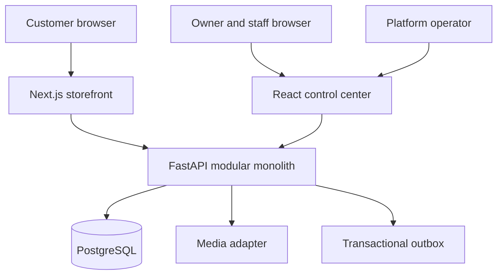

# 02 — Architecture

Summarizes blueprint §§3–6, 12–14, 17. The blueprint is authoritative.

## System shape

A **modular monolith in a monorepo**: one FastAPI backend, one PostgreSQL
database, one server-rendered Next.js storefront, one React control-center
SPA, and shared TypeScript packages. Feature growth happens by domain module,
not by adding services.



There is **no** Redis, message broker, search engine, Kubernetes, GraphQL, or
service mesh in the initial architecture. The first production topology fits
on one VPS behind Nginx.

## Locked decisions

These are fixed direction (see [decisions/](decisions/) for rationale).
Changing one requires a proposed ADR and architectural approval — never a
silent drift.

1. Modular monolith; extraction only on evidence (ADR-001).
2. pnpm-workspace monorepo with exact-version pinning (ADR-002).
3. Two frontend applications — storefront and control center (ADR-003).
4. FastAPI + Pydantic + SQLAlchemy 2 + Alembic + PostgreSQL backend.
5. Next.js App Router storefront with server rendering.
6. React + TypeScript strict + Vite + React Router control center; TanStack
   Query for server state; React Hook Form for forms.
7. OpenAPI-generated TypeScript API client; no handwritten contract copies
   (ADR-004).
8. Opaque database-backed browser sessions; no tokens in localStorage.
9. Integer minor-unit money everywhere.
10. Media behind a narrow storage adapter (local first, S3-compatible later).
11. Transactional outbox for asynchronous order work; no broker.
12. Polling before SSE/WebSockets.
13. PostgreSQL for integration tests; SQLite only for database-independent
    pure tests (ADR-005).
14. Subdomain-first hosting; custom domains deferred.
15. Row-Level Security deferred pending stable access patterns; isolation via
    tenant-scoped repositories, constraints, and permanent tests.

## Architecture principles

- **Tenant safety before convenience** — tenant identity explicit from HTTP
  request to database query; see
  [04_SECURITY_AND_TENANCY.md](04_SECURITY_AND_TENANCY.md).
- **Routers translate; services orchestrate; repositories persist.** HTTP
  routers contain no workflows or persistence. Application services own
  business transactions; repositories never commit.
- **Database constraints are part of the design** — Pydantic/React validation
  improves experience; constraints protect invariants.
- **Make invalid states hard to represent** — enums and state machines for
  status; snapshots for history; integer money.
- **Simple operations are a feature** — every added service must have a
  concrete current use.
- **Generated contracts prevent drift** — OpenAPI is the API contract.
- **Accessibility, security, observability are acceptance criteria**, not
  cleanup milestones.
- **Optimize for reversible decisions** — adapters at volatile boundaries;
  no speculative abstraction inside stable domains.
- **Documentation is executable context** — updated in the same change that
  alters behavior.

## Repository design

```text
restaurant-engine/
├── apps/
│   ├── storefront/                 # Next.js public experience (from M1)
│   └── control-center/             # business + platform admin (from M1)
├── packages/
│   ├── api-client/                 # generated client; never hand-edited (from M1)
│   ├── admin-ui/                   # shared operational components (when consumed)
│   ├── design-tokens/              # color/spacing/typography contracts (when consumed)
│   └── frontend-config/            # shared TS/ESLint/Prettier config (when consumed)
├── backend/
│   ├── app/
│   │   ├── core/                   # settings, database, security, tenancy, errors
│   │   ├── domains/                # identity, businesses, catalog, storefront,
│   │   │                           # media, hours, orders, audit
│   │   ├── api/                    # composition and shared HTTP concerns
│   │   └── main.py
│   ├── migrations/
│   ├── tests/                      # unit / integration / api / security
│   └── pyproject.toml
├── e2e/                            # Playwright journeys (when journeys exist)
├── docs/                           # this handbook + decisions/
├── scripts/                        # repeatable developer and ops commands
└── .github/workflows/
```

This tree is a direction, not permission to create empty folders. A directory
appears when its first real contents do. As of Milestone 1C: `backend/app/`
contains `core/`, `api/`, and `main.py` plus `migrations/`, `scripts/`, and
`tests/` (M1A/M1C); `apps/storefront` (Next.js App Router) and
`apps/control-center` (React + Vite + React Router) are the two application
shells (M1B); `packages/api-client` is the generated API client behind its
handwritten facade (M1C, ADR-009); root `scripts/` holds the contract-check
and dev-stack smoke scripts. `backend/app/domains/` appears with the first
domain in Milestone 2.

**API contract flow (M1C, ADR-009):** the backend exports a canonical
OpenAPI document (`packages/api-client/openapi.json`); `openapi-typescript`
generates pure types from it; a handwritten facade over `openapi-fetch` is
the package's only public surface. Both artifacts are committed, produced
only by `corepack pnpm generate:client`, and byte-compared against a fresh
temp-directory regeneration by `corepack pnpm contract:check` locally and in
CI. Operation IDs are explicit contracts, validated at application
composition time. Applications consume only the facade — the first real
consumers, and with them the CORS origin decision, arrive in Milestone 2.

**Control-center API consumption (M2E, ADR-015):** the control center is
the facade's first application consumer, with an origin-relative base URL
(`/api/...` under the page origin). Development uses a same-origin Vite
proxy to the API; production serves both behind one reverse-proxy origin.
The deferred CORS decision is thereby resolved: **no CORS middleware
exists** — there is no cross-origin surface. Session state lives solely
in a TanStack Query cache (opaque cookie session + in-memory CSRF token,
ADR-010/ADR-015).

**Frontend workspace conventions (M1B):** one root ESLint flat config and one
root `tsconfig.base.json` own shared configuration as plain files — a shared
package (`frontend-config`, `design-tokens`, `admin-ui`) is created only when
a real consumer exists in the same milestone. Apps never import from each
other. Styling is CSS custom properties + CSS Modules per app (no runtime
styling dependency). Dependency build scripts are blocked by default;
allowances live in `pnpm-workspace.yaml` and are individually reviewed.

### Backend domain module template

A mature domain may contain `models.py`, `schemas.py`, `repository.py`,
`service.py`, `policies.py`, `router_admin.py`, `router_public.py`,
`entities.py`, and `events.py` — but starts with only `models`, `schemas`,
`service`, `repository`, and the necessary router. Split a file when it has
multiple reasons to change.

### Dependency direction

HTTP → application services → domain policies / repository protocols →
SQLAlchemy. Core infrastructure never imports routers. A domain never imports
another domain's SQLAlchemy models to implement hidden logic; cross-domain
writes are coordinated by an application service in one transaction.

## API design

`/api/v1` from the start. Query resources are separated from workflow
commands (`POST .../orders/{id}/accept`, not a generic status PATCH).
Conventions: consistent error envelope with machine-readable code and
correlation ID; UTC ISO-8601 timestamps; integer minor-unit money with
currency; idempotency keys for order placement; explicit request/response
schemas (never serialized ORM objects). See blueprint §10.

## Deployment target (context only until Milestone 8)

One Ubuntu VPS running Docker Compose: Nginx, storefront, API,
control-center static assets, PostgreSQL on a private network with a
persistent volume, a worker once the outbox exists, and an encrypted backup
job. Wildcard subdomain DNS and certificate. Only ports 80/443 public. See
[07_DEPLOYMENT_RUNBOOK.md](07_DEPLOYMENT_RUNBOOK.md).
